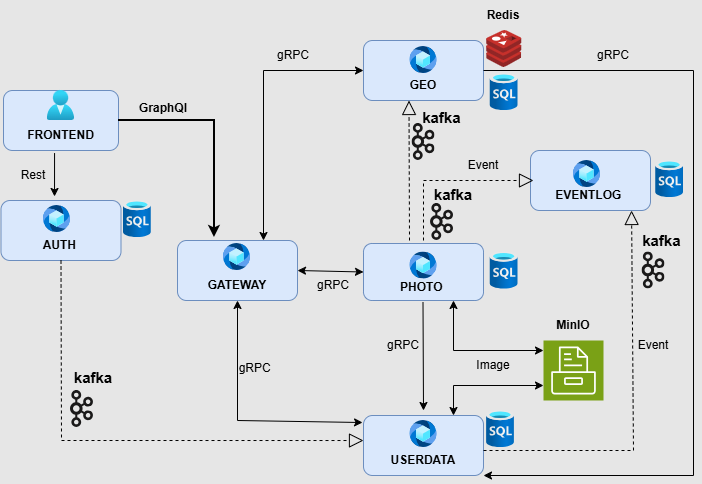

#  Rangiffler

**Rangiffler** — учебный микросервисный проект, представляющий собой простую социальную сеть для хранения и обмена фотографиями между пользователями.

Проект создан для изучения подходов к построению микросервисной архитектуры, асинхронного взаимодействия, тестирования и работы с мультимедийными данными.

**На текущем этапе тестами покрыта не вся функциональность, работа по оптимизации и расширению покрытия тестами продолжается.**

---



---

##  Технологический стек

### Backend
- **Java 21**, **Spring Boot** — основной стек сервисов (Spring Web, Authorization Server, OAuth 2.0 Resource Server, Spring Data JPA)
- **gRPC** — взаимодействие между микросервисами
- **GraphQL** — взаимодействие фронтенда с Gateway
- **Kafka** — асинхронная передача событий между сервисами (Auth ↔ Userdata, Userdata ↔ Photo → Eventlog)
- **MySQL** — хранилище данных
- **Redis** — кэширование гео-данных
- **MinIO** — объектное хранилище изображений (фото и аватары пользователей)
- **Docker / Docker Compose** — инфраструктура и оркестрация контейнеров

### Frontend
- **React** — веб-интерфейс приложения

### Тестирование и отчётность
- **JUnit 5** — модульные и интеграционные тесты
- **Selenide** — UI-автотесты
- **Wiremock** — изоляция внешних зависимостей
- **Allure** — визуализация и отчётность тестов
- **Gradle** — сборка и управление зависимостями

---

##  Архитектура микросервисов

| Сервис | Коммуникация | Хранилище | Назначение |
|:--------|:------------------|:------------|:-------------|
| **AUTH** | REST, Kafka | MySQL | Аутентификация пользователей, генерация событий |
| **GATEWAY** | gRPC, GraphQL | — | Центральная точка входа, маршрутизация, проверка JWT |
| **GEO** | gRPC, Kafka | MySQL, Redis | Геоданные и статистика по фотографиям |
| **PHOTO** | gRPC, Kafka | MySQL, MinIO | Работа с изображениями, передача событий в Eventlog |
| **USERDATA** | gRPC, Kafka | MySQL, MinIO | Профили пользователей, аватары, дружба, передача событий в Eventlog |
| **EVENTLOG** | Kafka | MySQL | Хранение событий (дружба, фото, изменения) |
| **FRONTEND** | GraphQL → Gateway | — | Веб-интерфейс пользователя |

---

##  Работа с изображениями

Поддерживаются два режима обмена изображениями:

1. **BLOB** — передача изображения напрямую между сервисами в формате dataURL.
2. **OBJECT** — изображение сохраняется в MinIO, а сервисы `photo` и `userdata` получают ссылку формата 'service_name/user_id/photo_id'. 
Gateway добавляет base_url и отдаёт фронтенду готовый адрес.  
   По умолчанию используется режим **OBJECT**.

### Особенности
- При запуске через Docker создаётся **бакет в MinIO** — *rangiffler-media* (инициализируется контейнером MinIO init, расположенным в сервисе photo).
- В сервисах **photo** и **userdata** установлены ограничения:  
  максимальный размер загружаемого изображения — **19 МБ**;  
  поддерживаемые форматы — **.jpeg, .png, .gif, .webp**.  
  Ошибки загрузки и неподдерживаемые форматы пробрасываются на фронтенд для отображения пользователю.

---

##  Асинхронное взаимодействие

- `PHOTO → Kafka → GEO` — события об изменении страны фотографии (обновление статистики).
- `AUTH → Kafka → USERDATA` — создание пользователя и передача имени.
- `PHOTO / USERDATA → Kafka → EVENTLOG` — события дружбы и изменений фотографий.

---

##  Кэширование

Сервис **GEO** использует **Redis** для кэширования:
- данных по всем странам,
- данных по отдельным запросам стран.

Это снижает нагрузку на базу данных и ускоряет выдачу статистики.

---

##  Тестовые данные и аннотации

Для тестов предусмотрена возможность использования **аннотаций**, создающих пользователей с необходимыми предусловиями.

- При указании параметра `full = true` создаётся пользователь с полной конфигурацией:  
  случайной **локалью** (страной проживания) и автоматически сгенерированными **именем** и **фамилией** на языке выбранной локали.
- Это необходимо для проверки корректности работы функциональности при разных языковых настройках.
- Все **фотографии**, созданные для такого пользователя, автоматически получают подписи на соответствующем языке локали.
- Подписи к фото также можно задать **вручную**, если требуется протестировать определённые тексты или сценарии.

Такой подход позволяет гибко моделировать реальные случаи взаимодействия пользователей из разных стран и языковых регионов, повышая качество и полноту тестового покрытия.

---

## Теги тестов

Доступные теги тестов: **web**, **grpc**, **gql**, **kafka**, **screenshots**.

Тесты с тегами **kafka** и **screenshots** в настоящий момент **исключены из запуска Docker-профиля**.  
Причины исключения:
- требуется обновление скриншотов для **Selenide**;
- необходимо повысить стабильность работы тестов, связанных с **Kafka**.

После устранения этих ограничений данные теги будут возвращены в состав полного тестового запуска.

---


##  Запуск проекта

### Режимы запуска
1. **Локальный профиль** — запуск backend и frontend локально:
    - Backend через Gradle
    - Frontend через npm

2. **Docker-профиль** — запуск всех сервисов, включая тесты, в изолированных контейнерах.

---

##  Предварительные требования

Для корректной работы проекта необходимо:
- Docker
- Docker Compose
- Java 21
- Node.js и npm
- Gradle

### Проверка окружения
```
docker --version
docker compose version
java -version
node -v
npm -v
```

---

##  Настройка hosts

Для корректной маршрутизации и отображения отчётности необходимо добавить в файл `hosts`:
```
127.0.0.1 frontend.rangiffler.dc
127.0.0.1 auth.rangiffler.dc
127.0.0.1 gateway.rangiffler.dc
127.0.0.1 allure
```

#  1. Локальный запуск

##  1.1. Полный запуск (инфраструктура + сервисы + фронт + тесты)

Скрипт **dev-local-run.sh** поднимает Docker-инфраструктуру (MySQL, Redis, Kafka, MinIO, Jaeger), запускает микросервисы (bootRun), фронтенд (npm run dev) и выполняет e2e‑тесты.

**Полный запуск:**
```
./dev-local-run.sh
```

**Запуск e2e‑тестов по тегам:**
```
./dev-local-run.sh web,grpc
```

**Автоостановка сервисов и фронта после завершения тестов:**
```
./dev-local-run.sh --stop
```

**Комбинация (теги + автоостановка):**
```
./dev-local-run.sh web,grpc --stop
```
---

##  1.2. Только инфраструктура

Скрипт **dev-local-up.sh** поднимает только инфраструктурные контейнеры в Docker для дальнейшей ручной разработки.

**Запуск инфраструктуры:**
```
./dev-local-up.sh
```

###  Ручной запуск после поднятия инфраструктуры

#### 1: Запуск сервисов

Запуск сервисов **rangiffler** с профилем `local`:
```
./gradlew :rangiffler-auth:bootRun --no-daemon --args="--spring.profiles.active=local"
./gradlew :rangiffler-userdata:bootRun --no-daemon --args="--spring.profiles.active=local"
./gradlew :rangiffler-geo:bootRun --no-daemon --args="--spring.profiles.active=local"
./gradlew :rangiffler-photo:bootRun --no-daemon --args="--spring.profiles.active=local"
./gradlew :rangiffler-event-log:bootRun --no-daemon --args="--spring.profiles.active=local"
./gradlew :rangiffler-gateway:bootRun --no-daemon --args="--spring.profiles.active=local"
```

#### 2: Запуск Frontend

Запуск фронтенда в режиме разработки:
```
cd rangiffl
```

#### 3: Запуск тестов

Запуск локальных **e2e‑тестов** из каталога модуля `rangiffler-e-2-e-tests`:
```
cd rangiffler-e-2-e-tests
../gradlew test
```

Запуск локальных **e2e‑тестов по тегам**:
```
cd rangiffler-e-2-e-tests
../gradlew test -DincludeTags=web,grpc
```
#  2. Docker‑режим

##  2.1. Запуск только сервисов (без тестов)

Скрипт **dev-docker-run.sh** собирает Docker‑образы, поднимает инфраструктуру и **запускает все сервисы в контейнерах**, без выполнения тестов.

**Запуск сервисов без тестов:**
```
./dev-docker-run.sh
```

После старта фронтенд доступен по адресу:
- **Frontend:** http://frontend.rangiffler.dc/

---

##  2.2. Полная среда для e2e (включая тесты)

Скрипт **dev-docker-e2e.sh** поднимает полную Docker‑среду и **запускает e2e‑тесты**.  
Доступно указание тегов тестов; при отсутствии тегов запускается набор **docker‑safe** тестов.

**Полный e2e‑запуск (без указания тегов):**
```
./dev-docker-e2e.sh
```

**e2e‑запуск с тегами (пример — web,grpc):**
```
./dev-docker-e2e.sh web,grpc
```

После старта фронтенд доступен по адресу:
- **Frontend:** http://frontend.rangiffler.dc/

##  To Do

План по дальнейшему развитию и стабилизации проекта:

-  **Unit-тесты для микросервисов** — покрытие ключевых модулей базовыми тестами.
-  **WireMock** — добавить в интеграционные тесты с эмуляцией внешних сервисов.
-  **Kafka** — расширить покрытие событий и протестировать взаимодействие *producer/consumer*; стабилизировать выполнение тестов.
-  **Режимы хранения** — добавить тесты на режимы **BLOB** и **OBJECT**, добавить аннотацию для проверки режима на уровне сервиса.
-  **Trace-ID** — продолжить интеграцию трассировки: код в *gateway* реализован, требуется внедрение и тестирование с использованием **Jaeger**.
-  **Selenide** — добавить скриншоты в тесты для Docker-профиля.  

